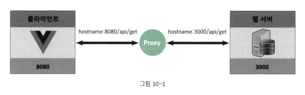

# Proxy 사용하기

-   프로젝트에서 클라이언트인 Vue 애플리케이션과 서버 애플리케이션을 분리해서 개발하고 각각의 별도의 포트로 운영하게 되는 경우가 많다.
-   클라이언트, 서버 애플리케이션 별도의 포트를 사용하는 경우 클라이언트 애플리케이션에서 서버로 HTTP요청을 하게 되면 CORS 문제가 발생 → 이러한 문제를 해결하기 위해 Proxy 서버 사용

## 프록시(Proxy) 서버

-   클라이언트가 자신을 통해서 다른 네트워크 서비스에 간접적으로 접속할 수 있게 해주는 응용프로그램
-   서버와 클라이언트 사이에 중계기로써 대리로 통신을 수행하는 것을 프록시(proxy)
-   중계 기능을 하는 것을 프록시(proxy) 서버

## CORS란

-   웹 애플리케이션에서 도메인, 포트, 프로토콜이 다른 곳으로 HTTP 요청을 보낼 수 없도록 브라우저가 요청을 막는 보안 정책

## CORS 해결방법

-   서버에서 접근을 허용해주면 된다.

```js
// Node.js express 서버의 예시
app.all("/*", function (req, res, next) {
    res.header("Access-Control-Allow-Origin", "*");
    res.header("Access-Control-Allow-Headers", "X-Requested-With");
    next();
});
```

## Proxy 설정하기

-   루트 디렉토리에 vue.config.js 파일 생성

```js
const target = "http://127.0.0.1:3000"; // proxy 요청을 보낼 서버 주소

module.exports = {
    devServer: {
        port: 8080,
        proxy: {
            // proxy 요청을 보낼 api 시작 부분
            "^/api": {
                target,
                changeOrigin: true
            }
        }
    }
};
```

-   Vue에서 proxy를 설정하고 클라이언트(브라우저)에서 HTTP 요청(포트:8080)을 하면 proxy 서버가 웹 서버로 HTTP 요청(포트:3000)을 대신 함으로써 CORS 문제를 해결
    

## 서버에서 CORS 해결

-   vue.config.js의 devServer에 proxy 설정할 경우, 개발환경에서는 정상적으로 수행되지만, 운영환경에서는 실행되지 않게 된다. CORS를 정확히 해결하려면 결국 서버에서 처리해야 한다.
-   API를 요청받는 서버에서 서버 헤더 중 Access-Control-Allow-Origin이라는 프로퍼티에 CORS를 허용해줄, 즉 클라이언트 도메인 주소를 등록해서 해결
-   서버 프로그램 중 하나인 Node.js의 예<br>: Node.js의 경우 cors라는 모듈을 활용하여 해결. Node에서 웹서버 역할을 하는 app.js 파일에 다음과 같은 코드 추가

    ```js
    const cors = require("cors");

    let corsOption = {
        origin: "http://localhost:8000", // 허락하는 요청 주소
        credentials: true // true로 하면 설정한 내용을 response 헤더에 추가해준다.
    };

    app.use(cors(corsOption)); // CORS 미들웨어 추가
    ```

-   Vue에서도 axios를 import한 소스 파일에서 코드 추가해주기
    ```js
    import axios from "axios";
    axios.defaults.baseURL = "http://localhost:3000"; // 서버주소
    axios.defaults.post["Content-Type"] = "application/json;charset=utf-8";
    axios.defaults.post["Access-Control-Allow-Origin"] = "*";
    ```
-   위 처럼 설정하면 vue.config.js의 proxy 설정 없이 개발환경이나 운영환경에서 CORS 문제 해결
