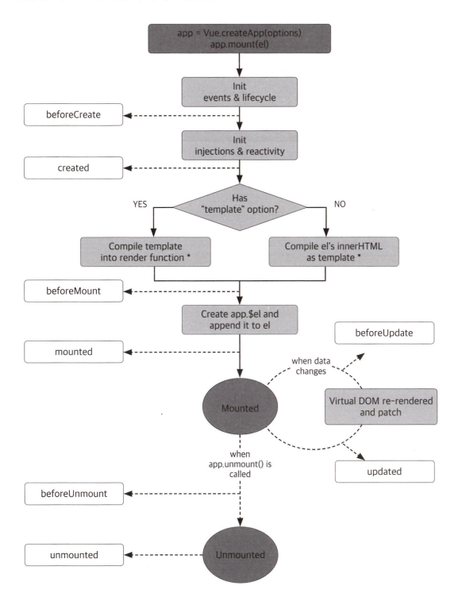

# 컴포넌트 Basic

## 컴포넌트란?

-   View, Data, Code의 세트
-   재사용이 가능하다
-   화면에서 보는 페이지 자체일 수도 있고 페이지 내의 특정 기능 요소일 수 있다.

## 컴포넌트 구조 이해하기

### 컴포넌트 기본 구조

```vue
<template>
    <div></div>
</template>
<script>
export default {
    name: "", // 컴포넌트 이름
    components: {}, // 다른 컴포넌트 사용 시 컴포넌트를 import하고, 배열로 저장
    data() {
        // html과 자바스크립트 코드에서 사용할 데이터 변수 선언
        return {
            sampleData: ""
        };
    },
    setup() {}, // 컴포지션 API
    created() {}, // 컴포넌트가 생성되면 실행
    mounted() {}, // template에 정의된 html 코드가 렌더링된 후 실행
    unmounted() {}, // unmount가 완료된 후 실행
    methods: {} // 컴포넌트 내에서 사용할 메소드 정의
};
</script>
```

-   &lt;template&gt; : view에 해당하는 html 코드 작성
-   name : 컴포넌트 이름(등록하지 않아도 사용하는 것에 지장❌)
-   components : 외부 컴포넌트를 사용하게 되면 해당 컴포넌트 import 후 배열로 등록!
-   data : html 코드와 자바스크립트 코드에서 전역 변수로 사용하기 위해 선언하는 데이터, 데이터 바인딩을 통해 화면에 해당하는 html과 코드에 해당하는 자바스크립트 간의 양방향 통신이 가능, 데이터 프로퍼티에 정의된 변수는 this를 통해 접근
-   setup : 컴포지션 API 구현하는 메소드
-   created : 컴포넌트가 생성되면 실행
-   mounted : 템플릿에 작성한 HTML 렌더링 후 실행
-   unmounted : 컴포넌트 빠져나갈때 실행
-   methods : 컴포넌트 내에서 사용할 메소드 정의, this를 통해서 접근

### Snippet 설정

> Code(File) > Preference > User Snippet > vue 입력

### Lifecycle Hooks

</img>

## 데이터 바인딩

-   양방향 데이터 바인딩 지원 (React는 단방향 데이터 바인딩) : 모델(Model)에서 데이터를 정의한 후 뷰(View)와 연결하면 모델과 뷰 중 어느 한쪽에 변경이 일어났을 때 다른 한쪽에 자동으로 반영되는 것을 의미
-   실제 프로젝트 내에서 데이터 바인딩 하는 경우
    -   데이터가 html tag 안에 텍스트로 바인딩
    -   데이터가 html tat 속성(attribute)으로 바인딩
    -   데이터가 html Form element의 value에 바인딩
    -   다중 데이터가 html 다중 element를 생성하기 위해서 바인딩

### 문자열 바인딩

-   이중 중괄호 이용해서 데이터 바인딩

```vue
<template>
    <h1>Hello, {{ title }}</h1>
</template>
<script>
export default {
    name: "DataBinding",
    components: {},
    data() {
        return {
            title: "World"
        };
    }
};
</script>
```

### raw(원시) HTML 데이터 바인딩

-   이중 중괄호를 이용하면 html 태그가 아닌 문자열로 인식
-   v-html 사용

```vue
<template>
    <div>
        <div>{{ htmlString }}</div>
        <div v-html="htmlString"></div>
    </div>
</template>
<script>
export default {
    name: "DataBinding",
    components: {},
    data() {
        return {
            htmlString: '<p style="color:red;">This is a red string</p>'
        };
    }
};
</script>
```

### Form 입력 데이터 바인딩

-   v-model 디렉티브 사용하여 양방향 데이터 바인딩 생성
-   v-model은 내부적으로 서로 다른 속성을 사용하고 서로 다른 입력 요소에 대해 서로 다른 이벤트를 전송한다

### Input type=text

-   단방향으로 데이터가 바인딩 된 것처럼 보이지만, 실제로는 텍스트 직접 입력하여 변경하면 데이터를 가져오는 별도의 코드 작성 없이 valueModel에 그대로 저장

### Input type=number

-   사용자의 입력 값이 문자가 아닌 숫자로 바로 처리할 수 있도록 v-model.number 디렉티브를 사용할 수 있다.

### Textarea

-   &lt;textarea v-model="message"&gt;&lt;/textarea&gt;

### Select

```vue
<template>
    <select v-model="city">
        <option value="02">서울</option>
        <option value="21">부산</option>
        <option value="064">제주</option>
    </select>
</template>
<script>
export default {
    name: "DataBinding",
    components: {},
    data() {
        return {
            city: "064"
        };
    }
};
</script>
```

### 체크박스(input type=checkbox)

-   v-model은 내부적으로 체크박스 checked 속성을 사용
-   v-model이 아닌 v-bind:value 사용

```vue
<template>
    <div>
        <label><input type="checkbox" v-model="checked" /> {{ checked }}</label>
    </div>
</template>
<script>
export default {
    name: "DataBinding",
    components: {},
    data() {
        return {
            checked: true
        };
    }
};
</script>
```

-   체크 되었을 때 기본 값 true, 해제되었을 때 기본 값 false
-   체크/해제 되었을 때의 기본 값 변경

```vue
<label><input type="checkbox" v-model="checked" true-value="yes" false-value="no" /> {{ checked }}</label>
```

-   여러 개의 체크박스를 사용할 때는 배열을 이용해서 데이터 바인딩해서 한 번에 처리 가능

```vue
<template>
    <div>
        <label><input type="checkbox" value="서울" v-model="checked" /> 서울</label>
        <label><input type="checkbox" value="부산" v-model="checked" /> 부산</label>
        <label><input type="checkbox" value="제주" v-model="checked" /> 제주</label>
        <br />
        <span>체크한 지역 : {{ checked }}</span>
    </div>
</template>
<script>
export default {
    name: "DataBinding",
    components: {},
    data() {
        return {
            checked: []
        };
    }
};
</script>
```

### 라디오(input type=radio)

-   v-bind:value

```vue
<template>
    <div>
        <label><input type="radio" v-bind:value="radioValue1" v-model="picked" /> 서울</label>
        <label><input type="radio" v-bind:value="radioValue2" v-model="picked" /> 부산</label>
        <label><input type="radio" v-bind:value="radioValue3" v-model="picked" /> 제주</label>
        <br />
        <span>선택한 지역 : {{ picked }}</span>
    </div>
</template>
<script>
export default {
    name: "DataBinding",
    components: {},
    data() {
        return {
            picked: "",
            radioValue1: "서울",
            radioValue2: "부산",
            radioValue3: "제주"
        };
    }
};
</script>
```

🚀 Form Element에 속하는 객체들은 v-model 디렉티브 사용하여 양방향 데이터 바인딩 처리를 할 수 있다!

### 속성(Attribute)

-   value를 제외한 HTML 객체의 속성에 데이터 바인딩 하기 위해서 v-bind:디렉티브 사용
-   v-bind를 생략하고 :으로 사용 가능

### img 객체의 src

```vue
<template>
    <div>
        
    </div>
</template>
<script>
export default {
    data() {
        return {
            imgSrc: "https://kr.vuejs.org/images/logo.png"
        };
    }
};
</script>
```

### button 객체의 disabled

-   조회화면에서 조회 조건 중 필수 입력 조건이 모두 입력 되었을 때 버튼 활성화
-   권한이 있는 사용자에게만 허용되는 버튼에 대해 활성화
-   예제 : input type=text에 데이터가 입력되는 순간 버튼 활성화

```vue
<template>
    <div>
        <input type="text" v-model="textValue" />
        <button type="button" v-bind:disabled="textValue == ''">Click</button>
    </div>
</template>
<script>
export default {
    data() {
        return {
            textValue: ""
        };
    }
};
</script>
```

### 클래스 바인딩

-   반드시 적용해야 하는 클래스는 기존 html에서 사용하던 방식처럼 class="클래스명", 조건에 따라 바인딩할 클래스의 경우는 v-bind:class를 이용해서 추가적으로 정의하여 사용
-   기본 클래스와 데이터 바인딩 처리를 하는 클래스를 공존해서 사용할 수 있다

```vue
<template>
    <div class="container" v-bind:class="{ active: isActive, 'text-red': hasError }">Class Binding</div>
</template>
<script>
export default {
    data() {
        return {
            isActive: true,
            hasError: false
        };
    }
};
</script>
<style scoped>
container {
    width: 100%;
    height: 200px;
}
.active {
    background-color: yellow;
    font-weight: bold;
}
.text-red {
    color: red;
}
</style>
```

-   클래스 바인딩의 경우 오브젝트 형태로 사용
-   바인딩할 클래스 Key, 바인딩 여부를 true/false로 지정
-   배열을 사용해서 클래스를 바인딩 가능

```vue
<template>
    <div class="container" v-bind:class="[activeClass, errorClass]">Class Binding</div>
</template>
<script>
export default {
    data() {
        return {
            activeClass: "active",
            errorClass: "text-red"
        };
    }
};
</script>
```

-   배열을 사용하는 경우 특정 조건에 따른 클래스 바인딩 처리를 true/false로 할 수 없다.

### 인라인 스타일 바인딩

-   데이터를 오브젝트로 선언해 바인딩 가능

```vue
<template>
    <div v-bind:style="styleObject">인라인 스타일 바인딩</div>
</template>
<script>
export default {
    data() {
        return {
            styleObject: {
                color: "red",
                fontSize: "13px"
            }
        };
    }
};
</script>
```

-   클래스 바인딩 처럼 배열을 이용해서 바인딩 가능

```vue
<template>
    <div v-bind:style="[baseStyle, addStyle]">인라인 스타일 바인딩</div>
</template>
<script>
export default {
    data() {
        return {
            baseStyle: "background-color:yellow; width:100%; height:200px;",
            addStyle: "color:red; font-weight:bold;"
        };
    }
};
</script>
```

## 리스트 렌더링(v-for)

-   select의 option, table의 tr 데이터 등 반복되는 객체를 처리할 때 사용
-   다중 데이터 처리할 때 사용
-   반복적으로 렌더링 할 html 태그에 v-for 디렉티브 사용

`v-for="(item, index) in items"`

-   items : 데이터 배열

```html
<table>
    <thead>
        <tr>
            <th>제품명</th>
            <th>가격</th>
            <th>카테고리</th>
            <th>배송료</th>
        </tr>
    </thead>
    <tbody>
        <tr v-for="(product, index) in productList">
            <td>{{product.product_name}}</td>
            <td>{{product.price}}</td>
            <td>{{product.category}}</td>
            <td>{{product.delivery_price}}</td>
        </tr>
    </tbody>
</table>
```

## 렌더링 문법(v-if, v-show)

### v-if

```html
<h1 v-if="bRender">bRender가 true면, h1 블록이 화면에 보이게 됩니다.</h1>
```

-   v-else 디렉티브를 사용해서 else 표현식 사용

```html
<h1 v-if="bRender">bRender가 true면, h1 블록이 화면에 보이게 됩니다.</h1>
<h1 v-else>bRender가 true가 아니면, 현재 블록이 화면에 보이게 됩니다.</h1>
```

-   v-else-if 디렉티브 사용해서 else if 표현식 사용

```html
<h1 v-if="type=='A'">A</h1>
<h1 v-else-if="type=='B'">B</h1>
<h1 v-else>C</h1>
```

### v-show

```html
<h1 v-show="bShow">bShow가 true이면, 현재 블록이 화면에 보이게 됩니다.</h1>
```

### v-if 와 v-show 차이점

|                                       **v-if**                                       |                                                              **v-show**                                                              |
| :----------------------------------------------------------------------------------: | :----------------------------------------------------------------------------------------------------------------------------------: |
|                 조건 만족시 html 블록 생성, 불만족시 html 블록 삭제                  | 조건 만족 여부에 상관없이 무조건 html 블록 생성, 만족시 css의 display를 이용해서 화면에 보이게 되고 조건 불만족시 화면에서 숨김 처리 |
| toggle이 일어날 때 v-show보다 더 많은 자원 사용 블록 전체를 생성했다가 삭제하기 때문 |                    처음 조건 만족하지 않더라도 html 블록을 무조건 생성한다는 단점 > 초기에 무조건 html 블록 생성                     |

🚀 해당 html 블록이 화면 내에서 자주 toggle이 일어나면 v-show 사용, 아니라면 v-if

## 이벤트 처리(v-on)

-   @로 사용도 가능

### 클릭 이벤트(v-on:click)

-   v-on:click="메소드명" / @click="메소드명"

```vue
<template>
    <div>
        <button type="button" @click="increaseCounter">Add 1</button>
        <p>The counter is : {{ counter }}</p>
    </div>
</template>
<script>
export default {
    data() {
        return {
            counter: 0
        };
    },
    methods: {
        increaseCounter() {
            this.counter = this.counter + 1;
        }
    }
};
</script>
```

-   클릭 이벤트를 통해 지정된 함수로 파라미터를 전달하고 싶을 때

```vue
<button type="button" @click="setCount(7)">Set 7</button>
<p>The counter is : {{counter}}</p>

methods: { setCount(counter) { this.counter = counter; } }
```

-   클릭 이벤트 발생 시 여러 개의 함수 호출

```vue
<button type="button" @click="one(), two()">Click</button>
```

### Change 이벤트

```vue
<template>
    <select v-model="selectValue" @change="changeSelect">
        <option value="서울">서울</option>
        <option value="부산">부산</option>
        <option value="제주">제주</option>
    </select>
</template>
<script>
export default {
    data() {
        return {
            selectValue: ""
        };
    },
    methods: {
        changeSelect() {
            alert(this.selectValue);
        }
    }
};
</script>
```

### Key 이벤트

-   키보드 자판을 입력할 때 발생하는 이벤트
-   입력창에 엔터키가 입력되는지를 계속 감시하다가 해당 키 입력되면 함수 호출

```vue
<input @keyup.enter="submit" />
```

> Key 이벤트 목록 : entder, tab, delete, esc, space, up, down, left, right

-   Control, Shift, Alt 다른 키와 같이 사용되는 특수 키의 경우

```vue
<!-- Alt + Enter -->
<input @keyup.alt.enter="clear" />
<!-- Ctrl + Click -->
<div @click.ctrl="doSomething">Do something</div>
```

## computed 와 watch

-   Vue 인스턴스 내의 정의된 데이터 값에 변경이 일어나는 지 감시하고, 변경될 때마다 정의된 함수 실행
-   사용되는 용도에 차이가 있다.

### computed

-   기존에 정의된 데이터 값을 기반으로 새로운 데이터 값을 활용하기 위해서 사용
-   정의된 데이터 값을 바탕으로 새로운 데이터 값을 생성하고, 새로운 데이터 값에서 참조하고 있는 기존 데이터 값의 변경을 감지
-   참조하고 있는 데이터 값의 변경과 상관없이 최초에 computed에 정의된 데이터 함수 실행

### watch

-   watch에 정의된 데이터 값 하나만을 감시하기 위한 용도로 사용
-   실제 데이터 변경이 일어나기 전까지는 실행❌
-   초기에 할당된 값에서 변경이 일어나야 watch에 정의한 함수를 실행
