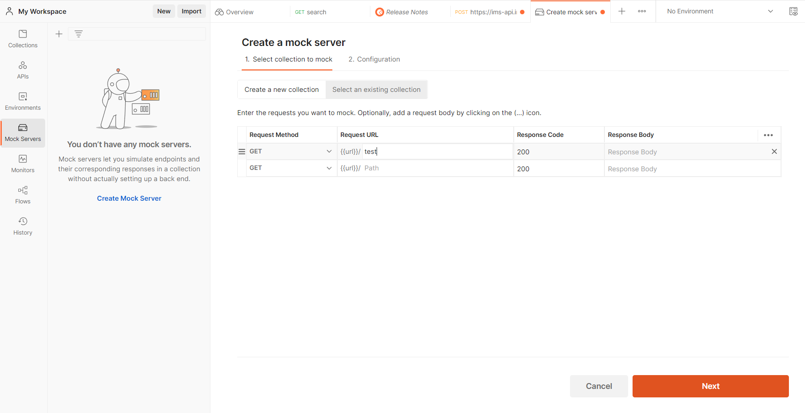
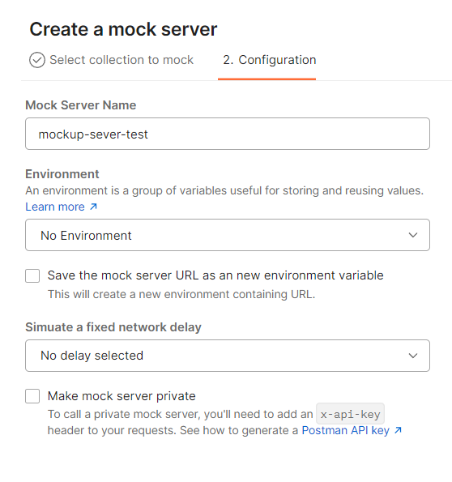
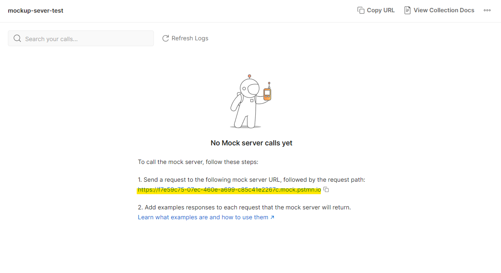
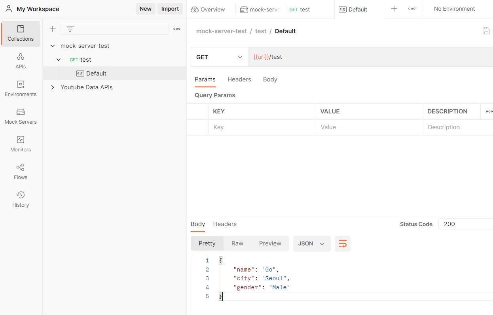
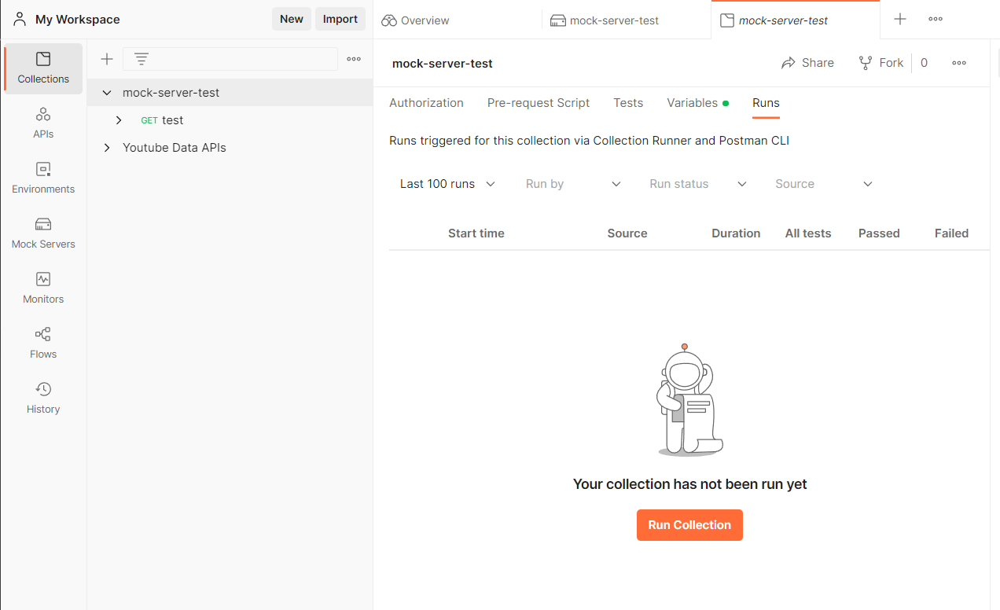
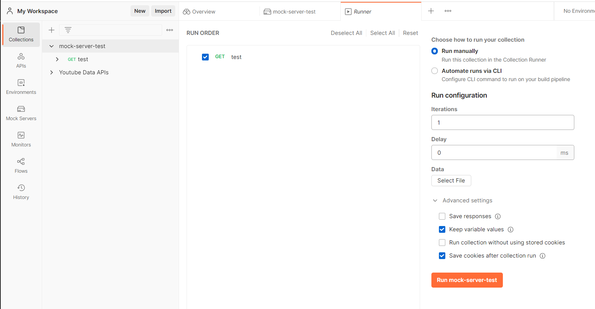

# Mock 서버 준비하기

-   실제 서버처럼 클라이언트로부터 요청을 받으면 응답하는 가짜 서버
-   실제처럼 api를 호출해서 데이터를 받아올 수 있다.
-   Postman 설치 > API 개발을 위한 협업 툴
-   대다수의 경우, 서버 프로그램이 제때 제공되지 않아, 프론트엔드 개발자가 서버 프로그램이 기다리는 상황이 많이 발생한다. > 시간적인 낭비를 줄이기 위해 Mock 서버 활용

## Mock 서버 생성

1. Create New 메뉴 클릭 > Mock Server 클릭 > path 입력 후 next
   </img>
2. Mock Server 이름 작성
   </img>
3. api 호출시 사용될 url
   </img>
4. 불러올 data 작성
   </img>
5. Mock 서버 실행시키기
   </img>
   </img>
