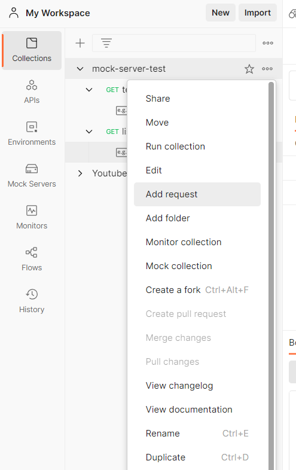

# 서버 데이터 바인딩 실습

## 서버와의 데이터 통신을 위한 API 호출 메소드 만들기

-   모든 데이터를 서버로부터 가져오고, 사용자의 인터렉션을 통해 발생한 데이터는 서버로 보내 데이터베이스에 저장

### Axios란?

-   서버와 데이터를 송수신 할 수 있는 HTTP 비동기 통신 라이브러리
-   Promise 객체 형태로 값을 return
-   자바스크립트 내장 함수 Fetch와 달리 구형 브라우저도 지원
-   응답 시간 설정하여 네트워크에 에러 발생시 정해진 응답 시간을 초과하면 해당 요청 종료
-   설치하기 : `npm install axios --save`
-   Axios에서 제공하는 request methods
    -   axios.request(config)
    -   axios.get(url[, config])
    -   axios.delete(url[, config])
    -   axios.head(url[, config])
    -   axios.options(url[, config])
    -   axios.post(url[, data[, config]])
    -   axios.put(url[, data[, config]])
    -   axios.patch(url[, data[, config]])

### 믹스인(Mixins) 파일 생성

-   다수의 컴포넌트에서 공통으로 사용하는 함수를 구현할 필요가 있다.
-   mixins를 통해 공통 함수를 만드는 이유 : 공통 함수를 구현해서 각각의 컴포넌트에서 호출해서 사용하는 방식이 효율적이다.
-   각 컴포넌트에서 함수를 별도 구현시 프로그램 내부의 비즈로직 변경 or 에러 수정 등 변경사항 발생시 각각의 컴포넌트 내에 정의된 함수를 찾아 바꿔야하는 위험성이 있을 수 있다.

## 서버 데이터 렌더링

### Mock 서버에 API 등록하기

1. Add request로 api 생성
   
2. api 이름 "list"로 변경 및 url {{url}}/list로 변경 > Add example 클릭
   
3. api get 했을 때 호출할 예시 데이터 작성
   

### 서버 데이터 호출 및 리스트 렌더링

```vue
<template>
    <div>
        <table>
            <thead>
                <tr>
                    <th>제품명</th>
                    <th>가격</th>
                    <th>카테고리</th>
                    <th>배송료</th>
                </tr>
            </thead>
            <tbody>
                <tr :key="i" v-for="(product, i) in productList">
                    <td>{{ product.product_name }}</td>
                    <td>{{ product.price }}</td>
                    <td>{{ product.category }}</td>
                    <td>{{ product.delivery_price }}</td>
                </tr>
            </tbody>
        </table>
    </div>
</template>
<script>
export default {
    data() {
        return {
            productList: []
        };
    },
    created() {
        this.getList();
    },
    methods: {
        async getList() {
            this.productList = await this.$api(
                "https://87a4abdc-12cb-4823-b3ad-4047a6a385a4.mock.pstmn.io/list",
                "get"
            );
        }
    }
};
</script>
<style scoped>
table {
    font-family: Arial, Helvetica, sans-serif;
    border-collapse: collapse;
    width: 100%;
}
td,
th {
    border: 1px solid #ddd;
    text-align: left;
    padding: 8px;
}
</style>

```
