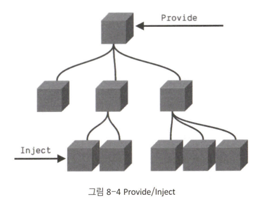

# 컴포넌트 심화 학습

## 컴포넌트 안에 다른 컴포넌트 사용하기

-   사용할 컴포넌트 import > 현재 컴포넌트의 템플릿에 사용할 컴포넌트 components에 등록
-   각 화면에서 동일한 컴포넌트를 import해서 사용하면 모든 화면에 대한 통일성
-   동일한 컴포넌트를 사용하기 때문에 해당 컴포넌트만 수정하면 모든 화면에 반영되어 훨씬 효율적으로 관리

```js
import ComponentA from "./ComponentA";
import ComponentC from "./ComponentC";

export default {
    components: {
        ComponentA,
        ComponentC
    }
};
```

### 부모 컴포넌트에서 자식 컴포넌트로 데이터 전달하기 : Props

-   컴포넌트 호출할 때 각 페이지의 데이터를 전달하고 컴포넌트에서 받은 데이터를 출력

```vue
<!-- 📌 자식 컴포넌트 -->
<template>
    <h2>{{ title }}</h2>
</template>
<script>
export default {
    props: {
        title: {
            type: String,
            default: "페이지 제목입니다."
        }
    }
};
</script>
```

🚀 props에 정의된 키는 Vue 인스턴스의 데이터 값으로 사용되기 때문에 h2에서 이중 중괄호 사용하여 문자열에 대한 데이터 바인딩 처리 가능

```vue
<!-- 📌 부모 컴포넌트 -->
<template>
    <div>
        <PageTitle title="부모 컴포넌트에서 자식 컴포넌트로 데이터 전달" />
    </div>
</template>
<script>
import PageTitle from "@/components/PageTitle.vue";

export default {
    components: { PageTitle }
};
</script>
```

🚀 컴포넌트에서 지정한 title 값이 자식 컴포넌트에 정의된 props의 title에 전달

### 동적 prop 전달

-   v-bind나 약어인 : 사용해서 prop에 동적인 값 전달 가능

```vue
<template>
    <div>
        <PageTitle :title="title" />
    </div>
</template>
<script>
import PageTitle from "@/components/PageTitle.vue";

export default {
    data() {
        return {
            title: "동적 페이지 타이틀"
        };
    },
    components: { PageTitle }
};
</script>
```

### 숫자형(Number) 전달

-   숫자 값을 prop으로 전달하기 위해서는 v-bind를 통해서만 가능
-   v-bind를 사용하지 않으면 숫자가 아닌 문자가 된다.

```vue
<!-- 42는 정적이지만, v-bind를 사용함으로써 전달되는 데이터가 자바스크립트 표현식이 됩니다. -->
<blog-post :likes="42" />

<!-- 변수 값에 동적으로 할당합니다. -->
<blog-post :likes="post.likes" />
```

### 논리 자료형(Boolean) 전달

-   v-bind를 사용하지 않으면 문자열로 전달되기 때문에 v-bind를 사용

```vue
<!-- true는 정적이지만, v-bind를 사용함으로써 전달되는 데이터가 자바스크립트 표현식이 됩니다. -->
<blog-post :is-published="true" />

<!-- 변수 값에 동적으로 할당합니다. -->
<blog-post :is-published="isShow" />
```

### 배열(Array), 객체(Object), 객체의 속성 전달

-   v-bind 사용하지 않으면 문자열로 전달

```vue
<!-- 두 개의 코드는 동일 -->
<blog-post v-bind="post" />
<blog-post :id="post.id" :title="post.title" />

<script>
export default {
    data() {
        return { post: { id: 1, title: "Vue 3 프로젝트 투입 일주일 전" } };
    }
};
</script>
```

### prop 유효성 검사

-   자식 컴포넌트에서 props 옵션을 정의할 때, 전달받는 데이터 타입, 기본 값(default), 필수 여부(required), 유효성 검사 함수(validator)인 함수를 통해서 유효성 검사 가능
-   props를 통해 전달받는 데이터에 대한 요구사항을 지정할 수 있기 때문에, 컴포넌트를 사용하는 개발자가 데이터를 어떤 타입으로 전달해야 할지 명확히 인지해서 사용할 수 있다는 이점을 얻을 수 있다.

```vue
<script>
export default {
    props: {
        // 기본 타입 체크("null", "undefined"는 모든 타입 유효성 검사를 통과한다.)
        propA: Number,
        propB: [String, Number], // 여러 타입 허용
        propC: {
            // 문자형이고 부모 컴포넌트로부터 반드시 데이터가 필수로 전달되어야 함
            type: String,
            required: true
        },
        propD: {
            // 기본 값(100)을 갖는 숫자형
            type: Number,
            default: 100
        },
        propE: {
            // 기본 값을 갖는 객체 타입
            type: Object,
            // 객체나 배열의 기본 값은 항상 팩토리 함수로부터 반환
            default: function () {
                return { message: "hello" };
            }
        },
        propF: {
            // 커스텀 유효성 검사 함수
            validator: function(value) {
                // 값이 꼭 아래 세 문자열 중 하나와 일치해야 한다.
                return {"success", "warning", "danger"}.indexOf(value) !== -1
            }
        },
        propG: {
            // 기본 값을 갖는 함수
            type: Function,
            // 객체나 배열과 달리 아래 표현은 팩토리 함수❌. 기본 값으로 사용되는 함수
            default:function() {
                return "Default function"
            }
        }
    }
};
</script>
```

### 부모 컴포넌트에서 자식 컴포넌트의 이벤트 직접 발생시키기

-   자식 컴포넌트 버튼 객체에 ref="btn"으로 접근할 수 있도록 작성
-   HTML 태그에 ref 지정하면 Vue 컴포넌트의 함수에서 this.$refs를 통해 접근 가능
-   ref 속성은 HTML 태그에서 사용되는 id와 비슷한 기능을 한다고 생각면 된다. > ref는 유일한 키 값을 사용

```vue
<!-- ChildComponent -->
<template>
    <button type="button" @click="childFunc" ref="btn">click</button>
</template>
<script>
export default {
    methods: {
        childFunc() {
            console.log("부모 컴포넌트에서 직접 발생시킨 이벤트");
        }
    }
};
</script>

<!-- ParentComponent -->
<template>
    <child-component @send-message="sendMessage" ref="child_component" />
</template>
<script>
import ChildComponent from "./ChildComponent";
export default {
    components: { ChildComponent },
    mounted() {
        this.$refs.child_component.$refs.btn.click();
    }
};
</script>
```

-   부모 컴포넌트에서 자식 컴포넌트인 child-component에 ref="child_component"를 지정, $refs로 접근할 수 있도록 했다.
-   부모 컴포넌트에서 자식 컴포넌트 안에 정의된 HTML 객체에 대한 접근 가능, 자식 컴포넌트의 버튼 객체에 정의한 ref="btn" 이름으로 버튼 객체에 접근해서 click() 이벤트 발생시킬 수 있다.

### 부모 컴포넌트에서 자식 컴포넌트의 함수 직접 호출하기

-   자식 컴포넌트에 함수 정의
-   부모 컴포넌트에서 자식 컴포넌트를 $refs를 사용하여 접근하게 되면 자식 컴포넌트 내에 정의된 모든 함수 호출 가능

```vue
<!-- ChildComponent -->
<script>
export default {
    methods: {
        callFromParent() {
            console.log("부모 컴포넌트에서 직접 호출한 함수");
        }
    }
};
</script>

<!-- ParentComponent -->
<template>
    <child-component @send-message="sendMessage" ref="child_component" />
</template>
<script>
import ChildComponent from "./ChildComponent";
export default {
    components: { ChildComponent },
    mounted() {
        this.$refs.child_component.callFromParent();
    }
};
</script>
```

### 부모 컴포넌트에서 자식 컴포넌트의 데이터 옵션 값 직접 변경하기

-   부모 컴포넌트에서 자식 컴포넌트의 데이터 옵션 값을 직접 변경 가능

```vue
<!-- ChildComponent -->
<template>
    <h1>{{ msg }}</h1>
</template>
<script>
export default {
    data() {
        return {
            msg: ""
        };
    }
};
</script>

<!-- ParentComponent -->
<template>
    <child-component @send-message="sendMessage" ref="child_component" />
    <button type="button" @click="changeChildData">Change Child Data</button>
</template>
<script>
import ChildComponent from "./ChildComponent";
export default {
    components: { ChildComponent },
    methods: {
        changeChildData() {
            this.$refs.child_component.msg = "부모 컴포넌트가 변경한 데이터";
        }
    }
};
</script>
```

### 자식 컴포넌트에서 부모 컴포넌트로 이벤트/데이터 전달하기 (커스텀 이벤트)

-   $emit 사용
-   자식 컴포넌트가 mounted 되면 $emit을 통해 부모 컴포넌트의 send-message 이벤트 호출 > 이때 msg 데이터를 파라미터로 전송한다.

```vue
<!-- ChildComponent -->
<script>
export default {
    data() {
        return {
            msg: "자식 컴포넌트로부터 보내는 메시지"
        };
    }
    mounted() {
        this.$emit("send-message", this.msg)
    }
};
</script>

<!-- ParentComponent -->
<template>
    <child-component @send-message="sendMessage" />
</template>

<script>
import ChildComponent from "./ChildComponent";
export default {
    components: { ChildComponent },
    methods: {
        sendMessage(data) {
            console.log(data);
        }
    }
};
</script>
```

### 부모 컴포넌트에서 자식 컴포넌트의 데이터 옵션 값 동기화하기

-   부모 컴포넌트에서 computed를 이용하면 자식 컴포넌트에 정의된 데이터 옵션 값의 변경사항을 항상 동기화시킬 수 있다.
-   부모 컴포넌트에는 computed 옵션 사용 > 자식 컴포넌트 msg 값을 감지
    > computed는 참조되고 있는 데이터의 변경사항을 바로 감지하여 반영
-   computed 옵션을 이용하면 자식 컴포넌트의 데이터가 변경될 때마다 $emit을 통해 변경된 데이터를 전송하지 않아도 변경된 데이터 값 항상 확인

```vue
<!-- ChildComponent -->
<template>
    <button type="button" @click="childFunc" ref="btn">자식 컴포넌트 데이터 변경</button>
</template>
<script>
export default {
    data() {
        return {
            msg: "메시지"
        };
    },
    methods: {
        childFunc() {
            this.msg = "변경된 메시지";
        }
    }
};
</script>

<!-- ParentComponent -->
<template>
    <button type="bitton" @click="checkChild">자식 컴포넌트 데이터 조회</button>
    <child-component ref="child_component" />
</template>
<script>
import ChildComponent from "./ChildComponent";
export default {
    components: { ChildComponent },
    computed: {
        msg() {
            return this.$refs.child_component.msg;
        }
    },
    methods: {
        checkChild() {
            alert(this.msg);
        }
    }
};
</script>
```

## Slot

-   컴포넌트 내에서 다른 컴포넌트를 사용할 떄 쓰는 컴포넌트의 마크업을 재정의하거나 확장
-   컴포넌트의 재활용성을 높여주는 기능
-   여러 명의 개발자가 애플리케이션 개발시, 동일한 유형의 팝업창일지라도 디자인이 다르게 적용되는 경우가 발생 > 일관성 없는 디자인으로 인해 좋지 않은 경험을 가질 수 있다.
-   Slot을 이용해 이런 부분을 해결할 수 있다.

```vue
<!-- SlotModalLayout -->
<template>
    <!-- 팝업의 기본틀 -->
    <div class="modal-container">
        <header>
            <slot name="header"></slot>
        </header>
        <main>
            <slot></slot>
        </main>
        <footer>
            <slot name="footer"></slot>
        </footer>
    </div>
</template>
```

🚀 Slot에 name을 지정해서 사용하는 것을 'Named Slots'라고 한다.

```vue
<!-- SlotUseModalLayout -->
<template>
    <modal-layout>
        <template v-slot:header>
            <h1>팝업 타이틀</h1>
        </template>
        <template v-slot:default>
            <p>팝업 컨텐츠 1</p>
            <p>팝업 컨텐츠 2</p>
        </template>
        <template>
            <button type="button">닫기</button>
        </template>
    </modal-layout>
</template>
```

-   컴포넌트 내에 여러 영역에 slot을 적용할 때는 name을 이용해서 적용하고, 하나의 영역에만 적용할 때는 굳이 slot에 name을 사용하지 않아도 된다.

```vue
<!-- PageTitle -->
<template>
    <h2>{{ title }}</h2>
</template>
<script>
export default {
    props: {
        title: {
            type: String,
            default: "페이지 제목입니다."
        }
    }
};
</script>

<!-- slot 사용하기 -->
<template>
    <h2><slot></slot></h2>
</template>

<PageTitle>컴포넌트 사용 예제 페이지</PageTitle>
```

-   v-slot: 대신에 단축어로 #
-   팝업 페이지 타이틀 등 애플리케이션 전반에 걸쳐 다수의 컴포넌트에서 공통으로 사용해야 하는 공통 UI 요소를 slot 기반의 컴포넌트로 만들어서 제공하면, 전체 애플리케이션 개발 생산성 및 통일된 디자인을 통한 사용자 경험을 향상시킬 수 있다.
-   이런 개발은 프로젝트 초기에 이루어져야 한다.
-   한번 개발된 slot 기반의 컴포넌트는 다른 애플리케이션 개발할 때도 사용 가능하기 때문에 개발팀의 자산으로 지속적 관리

## Provide / Inject

-   부모 컴포넌트에서 자식의 자식 컴포넌트로 데이터를 전달하려면 3단계를 거쳐야하지만, provide/inject를 사용하면 한 번에 바로 전달 가능

    > 부모 → 자식 컴포넌트 → 자식의 자식 컴포넌트


-   자식 컴포넌트로 전달하고자 하는 데이터를 provide에 정의
-   부모 컴포넌트로부터 전달받고자 하는 데이터와 동일한 속성 이름으로 inject에 문자열 배열로 정의

```vue
<!-- Parent Component -->
<template>
    <ProvideInjectChild />
</template>
<script>
import ProvideInjectChild from "./ProvideInjectChild";
export default {
    components: { ProvideInjectChild },
    data() {
        return {
            items: ["A", "B"]
        };
    },
    provide() {
        return {
            itemLength: this.items.length
        };
    }
};
</script>

<!-- Child Component -->
<script>
export default {
    inject: ["itemLength"],
    mounted() {
        console.log(this.itemLength);
    }
};
</script>
```

-   계층 구조가 복잡해도 원하는 자식 컴포넌트로 데이터 한 번에 전달 가능
-   But, inject를 통해서 데이터를 전달받는 자식 컴포넌트에서는 전달받는 데이터가 어떤 부모 컴포넌트에서 전달되는지 확인 불가능

## Template refs

-   Vue 개발 시 특별한 경우가 아니면 HTML 객체에 바로 접근해서 코드 구현할 일 ❌ > 어쩔 수 없이 자바스크립트에서 HTML 객체에 바로 접근해야 한다면 HTML 태그에 id 대신 ref 사용
-   this.$refs 이용하여 ref 속성에 지정된 이름으로 HTML 객체에 접근 가능

```
<input type="text" ref="title" />

this.$refs.title.focus();
```
