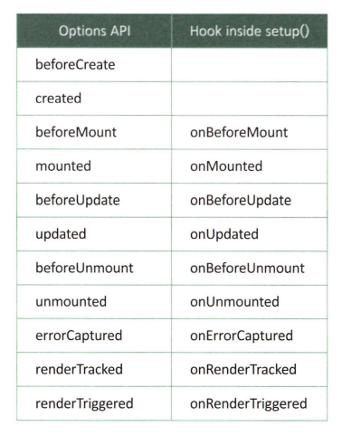

# Reusability & Composition

## Composition API

-   컴포넌트 내에서 사용하는 특정 기능을 갖는 코드를 유연하게 구성하여 사용할 수 있도록 Vue 3 버전에 추가된 함수 기반의 API
-   프로젝트 규모가 커질수록, 컴포넌트의 계층구조가 복잡할수록 코드에 대한 추적 및 관리가 어려운 점을 컴포지션 API 이용하면 Setup이라는 메소드 안에서 한 덩어리로 코드를 구현할 수 있다. > 코드에 대한 관리가 훨씬 쉬워지게 된다.
-   코드에 대한 재활용성을 높이고, 코드의 가독성을 높이기 위해 추가된 기능
-   Vue 2 에서는 믹스인(mixin)을 통해 코드 재사용 > 오버라이딩 문제, 다중 믹스인을 사용하는 경우 코드에 대한 관리가 어려웠다.
-   기존 개발 방식으로 개발했을 때보다 연관성 있는 로직을 같이 구현할 수 있어서 훨씬 코드가 간결해지고 코드 추적 및 유지 관리가 쉬워진다.
-   동일한 프로그램 로직과 관련된 코드를 함께 배치 할 수 있다면 훨씬 더 좋을 것이다. 컴포지션 API가 추가된 이유

### Setup

-   컴포지션 API를 구현하는 곳

✏️ 컴포지션 API가 어떻게 구현되는지 비교하기!

> 사용자로부터 숫자 2개 입력받고, 입력받은 숫자를 더한 값을 출력하기

```vue
<template>
    <div>
        <h2>Calculator</h2>
        <div>
            <input type="text" v-model="num1" @keyup="plusNumbers" />
            <span> + </span>
            <input type="text" v-model="num2" @keyup="plusNumbers" />
            <span> = </span>
            <span>{{ result }}</span>
        </div>
    </div>
</template>
<script>
export default {
    name: "calculator",
    data() {
        return {
            num1: 0,
            num2: 0,
            result: 0
        };
    },
    methods: {
        plusNumbers() {
            this.result = parseInt(this.num1) + parseInt(this.num2);
        }
    }
};
</script>
```

🚀 사용자로부터 숫자가 입력(keyup) 이벤트 발생할 때마다 plusNumbers 함수 호출해서 입력한 값 더하여 result로 반환

```vue
<!-- 컴포지션 API -->
<template>
    <div>
        <h2>Calculator</h2>
        <div>
            <input type="text" v-model="state.num1" @keyup="plusNumbers" />
            <span> + </span>
            <input type="text" v-model="state.num2" @keyup="plusNumbers" />
            <span> = </span>
            <span>{{ state.result }}</span>
        </div>
    </div>
</template>
<script>
import { reactive } from "vue"; // reactive 추가
export default {
    name: "calculator",
    setup() {
        let state = reactive({
            // reactive를 이용해서 num1, num2, result를 실시간 변경사항에 대한 반응형 적용
            num1: 0,
            num2: 0,
            result: 0
        });
        function plusNumbers() {
            state.result = parseInt(state.num1) + parseInt(state.num2);
        }
        return {
            // reactive로 선언된 state와 plusNumbers 함수를 반환함으로써 기존 data, methods 옵션처럼 사용 가능해짐
            state,
            plusNumbers
        };
    }
};
</script>

<!-- 코드 간결화 -->
<template>
    <div>
        <h2>Calculator</h2>
        <div>
            <input type="text" v-model="state.num1" />
            <span> + </span>
            <input type="text" v-model="state.num2" />
            <span> = </span>
            <span>{{ state.result }}</span>
        </div>
    </div>
</template>
<script>
import { reactive, computed } from "vue"; // computed 추가
export default {
    name: "calculator",
    setup() {
        let state = reactive({
            num1: 0,
            num2: 0,
            result: computed(() => parseInt(state.num1) + parseInt(state.num2)) // computed를 이용해서 num1, num2가 변경이 일어나면 즉시 result로 더한 값 반환
        });
        return {
            state
        };
    }
};
</script>
```

🚀reactive, computed를 이용하니까 input type=text에 바인딩했던 keyup 이벤트를 없앨 수 있어 코드가 훨씬 간결! But, 현재 컴포넌트 내에서만 사용 가능

```vue
<!-- 함수 분리 -->
<template>
    <div>
        <h2>Calculator</h2>
        <div>
            <input type="text" v-model="state.num1" />
            <span> + </span>
            <input type="text" v-model="state.num2" />
            <span> = </span>
            <span>{{ result }}</span>
        </div>
    </div>
</template>
<script>
import { reactive, computed, toRefs } from "vue"; // toRefs 추가
function plusCalculator() {
    let state = reactive({
        num1: 0,
        num2: 0,
        result: computed(() => parseInt(state.num1) + parseInt(state.num2))
    });
    return toRefs(state); // 반응형으로 선언된 num1, num2, result가 외부 function에서 정상적으로 동작하기 위해서는 toRefs를 사용해야 한다.
}
export default {
    name: "calculator",
    setup() {
        let { num1, num2, result } = plusCalculater(); // 외부 function
        return {
            num1,
            num2,
            result
        };
    }
};
</script>
```

-   외부 function에서 반응형 변수 사용하기 위해 toRefs 추가
-   컴포넌트 안에서는 v-model 디렉티브를 통해 바인딩된 변수가 사용자의 입력값이 바뀔 때마다 반응형으로 처리가 되었지만, 함수를 컴포넌트 밖으로 빼면 사용자가 입력한 값에 대한 반응형 처리 불가능 > toRefs 사용하여 반응형 처리 가능하도록 할 수 있다.

🚀컴포넌트 내에서 정의된 코드를 다른 컴포넌트에서도 사용할 수 있도록 컴포넌트 밖으로 분리하기

```js
// common.js
import { reactive, computed, toRefs } from "vue";
const plusCalculator = () => {
    let state = reactive({
        num1: 0,
        num2: 0,
        result: computed(() => parseInt(state.num1) + parseInt(state.num2))
    });
    return toRefs(state);
};
export { plusCalculator };
```

🚀Vue 컴포넌트에서 사용하기

```vue
<template>
    <div>
        <h2>Calculator</h2>
        <div>
            <input type="text" v-model="num1" />
            <span> + </span>
            <input type="text" v-model="num2" />
            <span> = </span>
            <span>{{ result }}</span>
        </div>
    </div>
</template>
<script>
import { plusCalculator } from "../common.js";
export default {
    name: "calculator",
    setup() {
        let { num1, num2, result } = plusCalculator();
        return {
            num1,
            num2,
            result
        };
    }
};
</script>
```

🚀 특정 기능을 갖는 함수를 컴포지션 API를 이용하고 개발해서 공통 스크립트로 제공하면 뷰 컴포넌트 내에서 반응형으로 처리를 할 수 있어서 매우 활용도가 높아진다.

### Lifecycle Hooks



-   컴포지션 API 내에서 사용할 수 있는 컴포넌트 라이프사이클 훅
-   setup()은 컴포넌트 라이프사이클의 beforeCreate와 created 훅 사이에서 실행되기 때문에, onBeforeCreate, onCreated 훅은 필요❌ setup() 안에서 코드 작성

```vue
<script>
export default {
    setup() {
        // mounted
        onMounted(() => {
            console.log("Component is mounted!");
        });
    }
};
</script>
```

### Provide/Inject

-   컴포지션 API에서 Provide/Inject 사용하려면 provide와 inject를 별도로 import 해야 사용할 수 있다.
-   부모 컴포넌트에서는 provide 함수를 통해서 전달할 값에 대한 키(key), 값(value)을

```vue
<template>
    <CompositionAPIInject />
</template>
<script>
import { provide } from "vue"; // provide 추가
import CompositionAPIInject from "./CompositionAPIInject";
export default {
    components: {
        CompositionAPIInject
    },
    setup() {
        provide("title", "Vue.js 프로젝트");
        // provide 함수를 통해서 전달할 키(key), 값(value) 설정
    }
};
</script>
```

-   자식 컴포넌트에서는 inject를 이용해서 부모 컴포넌트에서 정의한 provide 키로 데이터를 가져올 수 있다.

```vue
<template>
    <h1>{{ title }}</h1>
</template>
<script>
import { inject } from "vue"; // inject 추가
export default {
    setup() {
        const title = inject("title");
        // inject를 사용해서 provide에서 정의한 키(key)로 데이터를 전달받음
        return { title };
    }
};
</script>
```

## 믹스인(Mixins)

-   일반적인 프로그래밍 언어에서는 공통모듈이라고 부르는 파일을 만들어 개발한다.
-   공통모듈 파일에는 자주 사용되는 기능을 메소드로 만들어서 등록해 놓고, import하여 사용한다.
-   Vue에서도 이렇게 공통모듈에 해달하는 파일을 만들어서 사용 가능하다. > 그 중 하나의 방법이 믹스인!
-   믹스(Mix)-인(in) : 믹스인 파일을 컴포넌트 안에(in) 삽입해서, 합쳐서(mix) 사용한다.
-   일반적인 언어의 공통모듈처럼 메소드를 정의해서 사용할 수 있고, 이외에도 Vue의 라이프사이클 훅까지 사용할 수 있다. 이벤트 훅까지 사용할 수 있다는 것이 굉장히 큰 장점!
-   믹스인은 기능을 따로 구현하고, 필요할 때마다 믹스인 파일을 컴포넌트에 결합해서 사용하는 방법
-   ex) 애플리케이션 내의 모든 컴포넌트에서 사용자가 컴포넌트에 접근할 때마다 사용자가 해당 컴포넌트에 대한 접근권한 체크<br>> 각각의 모든 컴포넌트에서 생성되는 시점(beforeCreate) 사용자의 권한을 체크하는 로직을 다 넣는다고 생각하면 모든 컴포넌트에 중복된 코드가 양산<br>> 믹스인을 이용해서 사용자 권한 체크하는 로직을 구현<br>> 각각의 컴포넌트에서는 해당 믹스인 파일을 추가

[ 장점 ]

-   여러 컴포넌트에 동일한 로직을 사용할 필요가 있을 때 매우 유용
-   특정 기능을 캡슐화하여 코드의 수가 줄어들고 재사용성이 늘어난다.
-   사용자 권한 체크 로직이 변경이 일어났을 때 믹스인 파일만 수정하면 참조하고 있는 모든 컴포넌트에 반영

### 믹스인 파일 생성

-   axios 패키지를 이용해서 서버와의 데이터 통신을 위한 공통 함수를 작성

```js
// api.js
import axios from "axios";
export default {
    methods: {
        async $callAPI(url, method, data) {
            return (
                await axios({
                    method: method,
                    url,
                    data
                }).catch(e => {
                    console.log(e);
                })
            ).data;
        }
    }
};
```

-   함수 이름은 \$callAPI 이름에 "\$"라는 prefix를 사용하는 이유 : 믹스인 파일을 사용하는 컴포넌트 내에 동일한 메소드명이 있어서 오버라이딩 되는 것을 방지하기 위해서
-   일반적으로 컴포넌트에 정의되는 메소드명에서는 \$와 같은 prefix를 사용하지 않기 때문에 컴포넌트의 메소드명과 구분할 수 있다.

### 컴포넌트에서 믹스인 사용

```vue
<script>
import ApiMixin from "../api.js";
export default {
    mixins: [ApiMixin], // 사용할 믹스인 파일을 배열로 등록
    data() {
        return {
            productList: []
        };
    },
    async mounted() {
        this.productList = await this.$callAPI("api-url", "get");
        console.log(this.productList);
    }
};
</script>
```

-   믹스인은 메소드를 정의해서 컴포넌트에서 사용할 수 있게 해준다.
-   컴포넌트에서 일어나는 이벤트 훅을 그대로 이용할 수 있다는 큰 이점을 가지고 있다.

### 믹스인에서 라이프사이클 훅 이용하기

🚀애플리케이션을 이용하는 사용자가 방문한 페이지 및 페이지에 머문 시간을 기록하는 코드를 작성한다고 가정<br>> 믹스인에 사용자가 특정 페이지에 방문하고 빠져나갈 때 데이터베이스에 시간을 저장하는 메소드 작성

-   각 컴포넌트에서는 mounted 훅이 발생할 때 방문 시작 메소드 호출, unmounted 훅이 발생할 때 믹스인의 방문 종료 메소드 호출해서 데이터베이스에 방문 시작 시간, 방문 종료 시간 기록하여 페이지에 머문 시간 계산 가능
    > mounted, unmounted마다 모든 컴포넌트에서 믹스인 메소드 호출 → 간편하지만 굉장히 반복적이고 불편한 작업, 개발자의 실수로 특정 컴포넌트에 해당 코드를 작성하지 않으면 코드가 작성되지 않은 컴포넌트의 페이지 방문 이력 기록 불가능
-   믹스인에서 컴포넌트의 라이프사이클 훅을 그대로 이용할 수 있다. 믹스인 파일에 mounted, unmounted마다 데이터베이스에 방문 시작 시간, 방문 종료 시간을 기록하는 코드를 작성하면, 해당 믹스인 파일을 사용하는 모든 컴포넌트에서는 자동으로 데이터베이스에 방문 기록 저장

### 믹스인 파일 전역으로 등록하기: main.js에 등록

-   api를 호출하는 기능은 애플리케이션 내에 거의 모든 컴포넌트에서 사용하는 기능이므로 전역으로 등록해서 각 컴포넌트에서 별도의 mixins 추가 없이 사용할 수 있게 하겠다.

```js
// mixins.js
import axios from "axios";

export default {
    methods: {
        async $api(url, method, data) {
            return (
                await axios({
                    method: method,
                    url,
                    data
                }).catch(e => {
                    console.log(e);
                })
            ).data;
        }
    }
};

// main.js에 추가
import { createApp } from "vue";
import App from "./App.vue";
import router from "./router";
import mixins from "./mixins";

const app = createApp(App);
app.use(router);
app.mixin(mixins);
app.mount("#app");
```

## Custom Directives

-   v-model, v-show 디렉티브같은 기본 디렉티브 외에도 사용자가 직접 디렉티브를 정의해서 사용할 수 있다.

🚀사용자가 컴포넌트에 접속했을 때 지정된 입력 필드로 포커스를 위치시킬 수 있는 커스텀 디렉티브를 만들기! (커스텀 디렉티브를 전역에서 사용할 수 있도록 등록 가능, 특정 컴포넌트 안에서만 사용하도록 등록도 가능)

```js
const app = createApp(App);
app.directive("focus", {
    mounted(el) {
        el.focus();
    }
});
```

-   mounted 되면 v-focus 디렉티브를 적용한 HTML로 포커스(el.focus())를 위치시키도록 작성
-   컴포넌트에서 v-focus 디렉티브 사용하면 디렉티브가 정의된 HTML 객체에 마우스 포커스가 위치

    `<input type="text" v-focus>`

-   main.js에 전역으로 등록해서 많이 사용
-   컴포넌트 내에 등록해서 사용하는 방법 → directives 옵션에 정의

```vue
<script>
export default {
    directives: {
        focus: {
            mounted(el) {
                el.focus();
            }
        }
    }
};
</script>

<!-- 데이터 바인딩 처리 가능 -->
<template>
    <div style="height:1000px;">
        <p v-pin="position">페이지 고정 영역(position:fixed; top:50px; left:100px;)</p>
    </div>
</template>
<script>
export default {
    directives: {
        pin: {
            mounted(el, binding) {
                el.style.position = "fixed";
                el.style.top = binding.value.top + "px";
                el.style.left = binding.value.left + "px";
            }
        },
        data() {
            return {
                position: { top: 50, left: 100 }
            };
        }
    }
};
</script>
```

-   애플리케이션에서 필요한 커스텀 디렉티브를 잘 정의해서 사용한다면 애플리케이션 개발 생산성을 향상시킬 수 있다.

## Plugins

-   플러그인은 특정 기능을 제공하는 코드
-   Vue 프로젝트를 진행할 때 유용한 플러그인들을 설치하고 사용하고 있다.
-   NPM을 통해 설치되는 패키지 역시 플러그인
-   플러그인은 때로는 모듈로, 패키지로 사용될 수 있다.
-   특정 기능을 제공하고 쉽게 설치해서 사용할 수 있다.
-   대규모 프로젝트를 진행하다 보면 해당 프로젝트에 맞게 특화된 플러그인을 제작해야 하는 상황이 생길 수 있다.
-   Vue에서는 직접 플러그인을 제작해서 전역으로 사용할 수 있게 해준다.

🚀다국어(i18n)를 처리해 주는 플러그인 제작

```js
// src/plugins/i18n.js
export default {
    install: (app, options) => {
        app.config.globalProperties.$translate = key => {
            return key.split(".").reduce((o, i) => {
                if (o) return o[i];
            }, options);
        };
        app.provide("i18n", options); // i18n 키로 다국어 데이터 전달
    }
};
```

-   플러그인은 install 옵션에서 정의하여 사용할 수 있다. → app.config.globalProperties를 선언하여 컴포넌트에서 $translate로 바로 접근해서 사용할 수 있다.
-   provide로 다국어 데이터를 전달해서 컴포넌트에서는 inject를 이용해서도 사용 가능
-   다국어 플러그인은 전역에서 사용해야 하므로 main.js 파일을 열어서 다국어 플러그인을 사용할 수 있도록 추가해야 한다.

```js
// main.js
import i18nPlugins from "./plugins/i18n";
const i18nStrings = {
    en: {
        hi: "Hello!"
    },
    ko: {
        hi: "안녕하세요!"
    }
};
const app = createApp(App);
app.use(i18nPlugin, i18nStrings); // i18n 플러그인에 다국어 번역 데이터를 파라미터로 전달
app.mount("#app");
```

-   i18nStrings 변수를 선언해서 다국어 번역이 필요한 내용을 정의한 후 i18nPlugin으로 전달

```vue
<!-- 컴포넌트에서 사용하기 -->
<template>
    <div>
        <!-- $translate으로 사용 -->
        <h2>{{ $translate("ko.hi") }}</h2>
        <!-- inject로 사용 -->
        <h2>{{ i18n.ko.hi }}</h2>
    </div>
</template>
<script>
export default {
    inject: ["i18n"], //provide로 전달된 i18n을 inject로 사용할 수 있음
    mounted() {
        console.log(this.i18n);
    }
};
</script>
```
